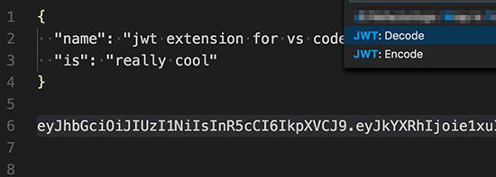

# JWT Extension for VS Code

Makes it easy to sign and verify JWT tokens in VS Code.

## Features

1. Sign a JWT token using a shared secret or a private key (set in extension settings)
2. Verify a JWT token using a shared secret or public key (set in extension settings)

## Extension Settings

This extension contributes the following settings:

* `jwt.secret`: A shared secret or a private key for signing JWT tokens.
* `jwt.pubKey`: A public key for verifying JWT tokens, if using asymmetric verification
* `jwt.duration`: Duration for JWT tokens. Defaults to "24h"

## Release Notes

### 1.1.0

Major improvement: properly supporting JSON and plain-text payloads.

### 1.0.0

Initial release.

**Enjoy!**